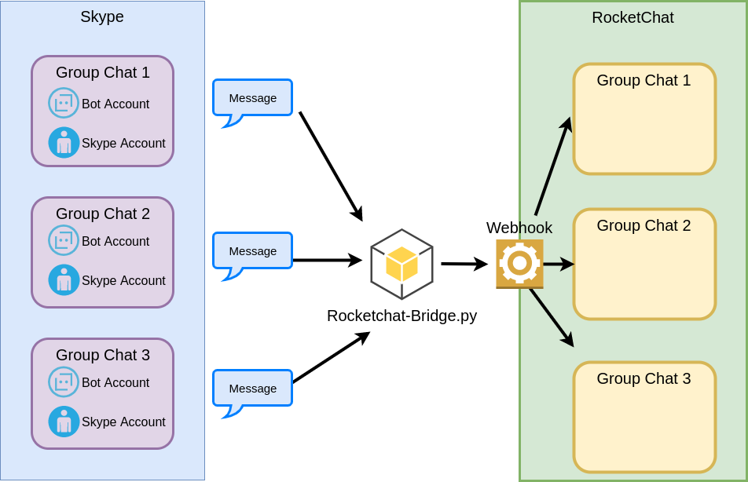
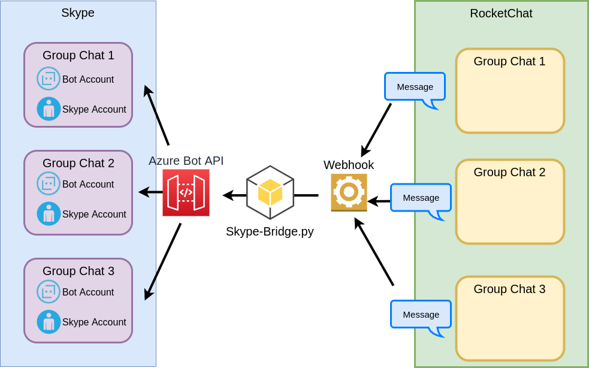

Overview

This is an overview how it work.

It rely on SkPy to retrieve message from the group chat. The skype bot account in the group chat wouldn't send the message detail to the webhook endpoint unless it's name was mention or the message to all.

From RocketChat to Skype is much more easy. Will modify further so that the RocketChat webhook can direct send message to the Skype Bot in Azure. Just need to send the message and the conversation id to the bot.

In detail.

[Pending]
